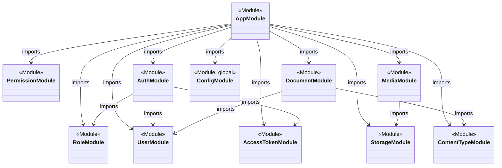
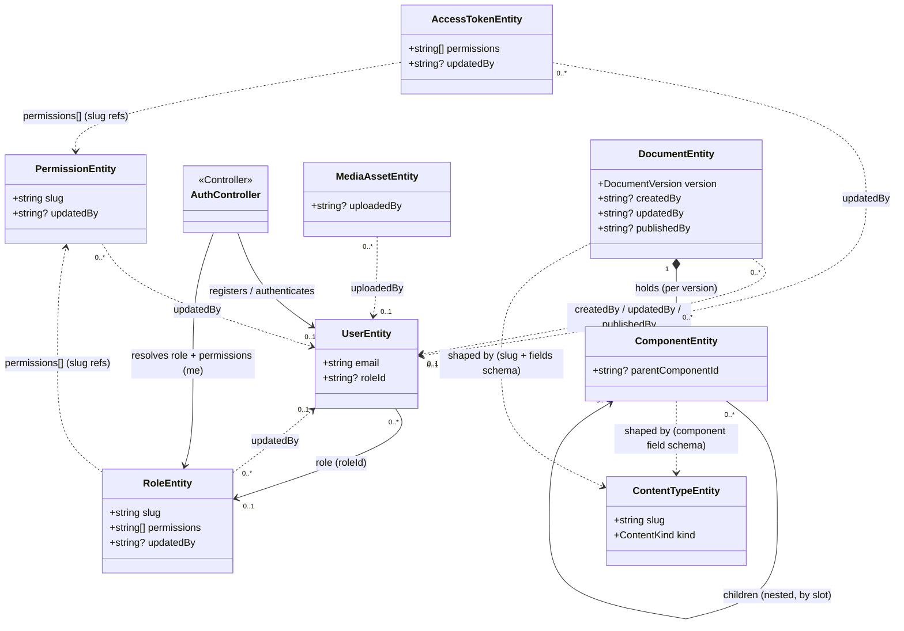

# App / Permission / Role / User / Auth — class diagram

How `AppModule` wires the Config, Permission, Role, User, Auth,
AccessToken, Media, Storage, ContentType, and Document modules, the shape
of each domain entity underneath, and — since each module is built
hexagonal-style — whether the `domain/application/infrastructure/presentation`
dependency direction is actually followed. Read directly from
`app.module.ts`, `auth.module.ts`, the eight `*.entity.ts` files, the
`domain/`/`application/`/`infrastructure/`/`presentation/` source of each
module, `config/env.validation.ts`, and `prisma/postgresql/schema.prisma`
— not inferred.

Four diagrams below, each kept small enough to stay legible: a
**layered view** (split in two, by domain) to check the Clean
Architecture dependency rule, then **module wiring** and **entity
relationships** (also split) for how `AppModule` composes everything and
how the entities relate to each other.

## Layered view — Clean Architecture dependency check

Same nine modules, this time scoped into their four layers —
`domain/`, `application/`, `infrastructure/`, `presentation/` — so the
dependency direction can be read directly off the arrows. Split into two
diagrams by domain (Identity/Access, then Content/Media) so each one
actually renders at a legible size; two edges cross between them
(`DocumentApplication`/`CollectionTypeDocumentController` →
`IUserRepository`), called out where they appear. `ConfigModule` is left
out of both — it has no `domain/`/`application/`/`infrastructure/`/
`presentation/` split at all, just a module + a validation class, so
there's no layer for it to be scoped into.

**Legend:** `-->` = depends on / calls. `..|>` = implements (the
dependency-inversion realization — the arrow still points at the
interface it conforms to, i.e. inward).

### Identity & Access — Permission, Role, User, Auth, AccessToken

```mermaid
classDiagram
    direction TB

    namespace Domain {
        class PermissionEntity
        class IPermissionRepository {
            <<interface>>
        }
        class RoleEntity
        class IRoleRepository {
            <<interface>>
        }
        class UserEntity
        class IUserRepository {
            <<interface>>
        }
        class AccessTokenEntity
        class IAccessTokenRepository {
            <<interface>>
        }
        class IEmailSender {
            <<interface>>
        }
    }

    namespace Application {
        class PermissionApplication {
            ListPermissionService
            CreatePermissionService
            UpdatePermissionService
            DeletePermissionService
        }
        class RoleApplication {
            ListRolesService
            CreateRoleService
            UpdateRoleService
            DeleteRoleService
        }
        class UserApplication {
            ListUserService
            UpdateUserService
            UpdateUserRoleService
            DeleteUserService
        }
        class AccessTokenApplication {
            ListAccessTokensService
            CreateAccessTokenService
            RevokeAccessTokenService
            DeleteAccessTokenService
        }
        class AuthApplication {
            RegisterService
            VerifyOtpService
            ResendOtpService
            HasUsersService
            LoginService
            RefreshTokenService
            ForgotPasswordService
            ResetPasswordService
            GetMeService
        }
    }

    namespace Infrastructure {
        class PrismaPermissionRepository
        class RoleInfrastructure {
            PrismaRoleRepository
            PrismaUserRoleCountRepository
        }
        class PrismaUserRepository
        class PrismaAccessTokenRepository
        class AuthInfrastructure {
            ConsoleEmailSender
            SmtpEmailSender
            GmailApiEmailSender
            ApiTokenStrategy
            JwtStrategy
            JwtRefreshStrategy
            LocalStrategy
        }
    }

    namespace Presentation {
        class PermissionController
        class RolesColtroller
        class UserController
        class AccessTokenController
        class AuthController
    }

    PermissionController --> PermissionApplication : calls
    PermissionApplication --> PermissionEntity : uses
    PermissionApplication --> IPermissionRepository : depends on
    PrismaPermissionRepository ..|> IPermissionRepository : implements

    RolesColtroller --> RoleApplication : calls
    RoleApplication --> RoleEntity : uses
    RoleApplication --> IRoleRepository : depends on
    RoleInfrastructure ..|> IRoleRepository : implements
    RoleApplication --> IPermissionRepository : validates permission slugs

    UserController --> UserApplication : calls
    UserApplication --> UserEntity : uses
    UserApplication --> IUserRepository : depends on
    PrismaUserRepository ..|> IUserRepository : implements
    UserApplication --> IRoleRepository : validates role assignment

    AccessTokenController --> AccessTokenApplication : calls
    AccessTokenApplication --> AccessTokenEntity : uses
    AccessTokenApplication --> IAccessTokenRepository : depends on
    PrismaAccessTokenRepository ..|> IAccessTokenRepository : implements
    AccessTokenApplication --> IPermissionRepository : validates permission slugs

    AuthController --> AuthApplication : calls
    AuthApplication --> IUserRepository : depends on
    AuthApplication --> IRoleRepository : depends on
    AuthApplication --> IEmailSender : depends on
    AuthInfrastructure ..|> IEmailSender : implements
    AuthInfrastructure --> IAccessTokenRepository : validates bearer tokens
```

### Content & Media — Media, Storage, ContentType, Document

`IUserRepository` reappears here as a stub (no members) purely as the
target of two edges reaching back into the Identity diagram above — it's
the same interface, not a duplicate.

```mermaid
classDiagram
    direction TB

    namespace Domain {
        class MediaAssetEntity
        class IMediaAssetRepository {
            <<interface>>
        }
        class StorageAdapter {
            <<interface>>
        }
        class ContentTypeEntity
        class IContentTypeRepository {
            <<interface>>
        }
        class ISchemaTableRepository {
            <<interface>>
        }
        class DocumentEntity
        class ComponentEntity
        class IDocumentRepository {
            <<interface>>
        }
        class IComponentRepository {
            <<interface>>
        }
    }

    class IUserRepository {
        <<interface, Identity module>>
    }

    namespace Application {
        class MediaApplication {
            UploadMediaService
            ListMediaService
            DeleteMediaService
        }
        class ContentTypeApplication {
            SchemaLoaderService
            ContentTypeSyncService
            ListContentTypeService
            GetContentTypeService
            UpdateListFieldsService
        }
        class DocumentApplication {
            SchemaResolverService
            ComponentIoService
            SaveDocumentService
            SaveSingleTypeService
            PublishDocumentService
            PublishSingleTypeService
            UnpublishDocumentService
            UnpublishSingleTypeService
            DeleteDocumentService
            BulkDeleteService
            GetDocumentForEditService
            GetSingleTypeService
            GetPublicDocumentService
            GetPublicSingleTypeService
            ListDocumentsService
            ListDocumentsFullService
            DuplicateDocumentService
            BulkCreateAndPublishService
        }
    }

    namespace Infrastructure {
        class PrismaMediaRepository
        class StorageInfrastructure {
            LazyStorageAdapter
            CloudinaryStorageAdapter
            S3StorageAdapter
        }
        class ContentTypeInfrastructure {
            PrismaContentTypeRepository
            PrismaSchemaTableRepository
        }
        class DocumentInfrastructure {
            PrismaDocumentRepository
            PrismaComponentRepository
        }
        class PrismaService
    }

    namespace Presentation {
        class MediaController
        class ContentTypeController
        class SingleTypeDocumentController
        class CollectionTypeDocumentController
        class PublicDocumentController
    }

    MediaController --> MediaApplication : calls
    MediaApplication --> MediaAssetEntity : uses
    MediaApplication --> IMediaAssetRepository : depends on
    PrismaMediaRepository ..|> IMediaAssetRepository : implements
    MediaApplication --> StorageAdapter : depends on
    StorageInfrastructure ..|> StorageAdapter : implements

    ContentTypeController --> ContentTypeApplication : calls
    ContentTypeApplication --> ContentTypeEntity : uses
    ContentTypeApplication --> IContentTypeRepository : depends on
    ContentTypeApplication --> ISchemaTableRepository : depends on
    ContentTypeInfrastructure ..|> IContentTypeRepository : implements
    ContentTypeInfrastructure ..|> ISchemaTableRepository : implements

    SingleTypeDocumentController --> DocumentApplication : calls
    CollectionTypeDocumentController --> DocumentApplication : calls
    PublicDocumentController --> DocumentApplication : calls
    DocumentApplication --> DocumentEntity : uses
    DocumentApplication --> ComponentEntity : uses
    DocumentApplication --> IDocumentRepository : depends on
    DocumentApplication --> IComponentRepository : depends on
    DocumentInfrastructure ..|> IDocumentRepository : implements
    DocumentInfrastructure ..|> IComponentRepository : implements
    DocumentApplication --> IUserRepository : resolves createdBy/updatedBy names
    CollectionTypeDocumentController --> IUserRepository : resolves display names
    DocumentApplication --> ContentTypeApplication : app-to-app, not app-to-domain (see audit)
    DocumentApplication --> PrismaService : VIOLATION, bypasses IDocumentRepository (see audit)
```

**Dependency-rule audit.** Grepped every `domain/`, `application/`,
`infrastructure/`, and `presentation/` file in these nine modules for
direction violations:

- `PrismaService` used outside an `infrastructure/` folder → **8
  violations**, all in `document/application/services/`:
  `save-document`, `save-single-type`, `publish-document`,
  `publish-single-type`, `unpublish-document`, `unpublish-single-type`,
  `duplicate-document`, `delete-document`. Each injects `PrismaService`
  directly to open a `$transaction`, then passes the resulting `tx` into
  `IDocumentRepository`/`IComponentRepository` calls so a document write
  and its component writes commit atomically — a real, deliberate reason,
  but it does mean the application layer depends on a concrete
  infrastructure class instead of the repository abstraction.
- `domain/` importing an infrastructure-specific type → **2 violations**:
  `document/domain/repositories/document.repository.ts` and
  `component.repository.ts` both type their `tx` parameter as
  `Prisma.TransactionClient`, imported from the generated Prisma client.
  The domain port's signature leaks a persistence-technology type — the
  same transaction-propagation need as above, pushed one layer deeper.
- `application/` importing a concrete `Prisma*Repository` class instead
  of its interface → none found (elsewhere in the codebase)
- `presentation/` importing `infrastructure/` directly → none found
- Every other cross-module reference — `RoleApplication →
  IPermissionRepository`, `UserApplication → IRoleRepository`,
  `AccessTokenApplication → IPermissionRepository`, `AuthApplication →
  IUserRepository`/`IRoleRepository`, `AuthInfrastructure →
  IAccessTokenRepository`, `MediaApplication → StorageAdapter`,
  `ContentTypeApplication → IContentTypeRepository`/
  `ISchemaTableRepository`, `DocumentApplication`/
  `CollectionTypeDocumentController → IUserRepository` — all go through
  the target module's exported repository **interface** token, never a
  concrete class. One exception in kind rather than direction:
  `DocumentApplication`'s `SchemaResolverService` calls
  `ContentTypeApplication`'s `GetContentTypeService` directly, i.e. an
  Application→Application dependency rather than the Application→Domain
  pattern every other cross-module edge follows. Still points inward (not
  toward Document's own outer layers), just skips a rung.

So: 8 of 9 modules (Permission, Role, User, Auth, AccessToken, Media,
Storage, ContentType) hold the Dependency Rule with zero violations.
`Document` has the two related violation categories above — both traced
to the same root cause (cross-repository transactional writes), not
scattered carelessness.

`RolesColtroller` is the actual (typo'd) class name in
`roles/presentation/role.controller.ts` — kept verbatim rather than
"corrected" so this stays a literal reflection of the code.

`StorageModule` has no entity and no presentation layer at all — it
exists purely to bind `STORAGE_ADAPTER` to a `LazyStorageAdapter` (which
in turn resolves to Cloudinary or S3 at runtime based on
`STORAGE_PROVIDER`). It's a pure infrastructure-providing module, and
`MediaApplication` (`UploadMediaService`) is its only consumer — a clean
example of a module whose entire public surface is one interface.

## Module wiring

`EnvironmentVariables` (`class-validator` schema, 29 fields —
`config/env.validation.ts`) isn't drawn: `ConfigModule` is its only
relationship (`validateSync()` on boot) and adding it here would just be
one more box for one edge.

## Entity relationships

Solid arrows are structural (module import, one-to-many ownership). Dashed
arrows are soft references — an audit pointer or a value stored without a
foreign key. Fields are trimmed to the ones a relation or note refers to —
full field lists are in [Entity fields](#entity-fields) below.

## Entity fields

### `PermissionEntity` — `permissions/domain`

| Field | Type |
|---|---|
| `documentId` | `string` |
| `slug` | `string` |
| `name` | `string` |
| `description` | `string \| undefined` |
| `createdAt` | `Date` |
| `updatedAt` | `Date` |
| `updatedBy` | `string \| null` |

### `RoleEntity` — `roles/domain`

| Field | Type |
|---|---|
| `documentId` | `string` |
| `name` | `string` |
| `slug` | `string` |
| `permissions` | `string[]` |
| `level` | `number` |
| `isDefault` | `boolean` |
| `createdAt` | `Date` |
| `updatedAt` | `Date` |
| `updatedBy` | `string \| null` |

### `UserEntity` — `users/domain`

| Field | Type |
|---|---|
| `documentId` | `string` |
| `email` | `string` |
| `name` | `string` |
| `username` | `string` |
| `password` | `string` |
| `accountType` | `boolean` |
| `verified` | `boolean` |
| `roleId` | `string \| null` |
| `createdAt` | `Date` |
| `updatedAt` | `Date` |
| `otpCodeHash` | `string \| null` |
| `otpExpiresAt` | `Date \| null` |
| `resetTokenHash` | `string \| null` |
| `resetTokenExpiresAt` | `Date \| null` |

### `AccessTokenEntity` — `access-tokens/domain`

Long-lived API tokens (not the session JWTs) — issued for service-to-service
or scripted access, scoped by their own `permissions` slug list independent
of any user's role.

| Field | Type |
|---|---|
| `documentId` | `string` |
| `name` | `string` |
| `token` | `string` |
| `permissions` | `string[]` |
| `expiresAt` | `Date \| null` |
| `createdAt` | `Date` |
| `updatedAt` | `Date` |
| `updatedBy` | `string \| null` |

### `MediaAssetEntity` — `media/domain`

Metadata row for an uploaded image; the binary itself lives with the
storage provider (Cloudinary or S3), addressed by `publicId`.

| Field | Type |
|---|---|
| `documentId` | `string` |
| `fileName` | `string` |
| `mimeType` | `string` |
| `size` | `number` |
| `width` | `number` |
| `height` | `number` |
| `url` | `string` |
| `thumbnailUrl` | `string` |
| `publicId` | `string` |
| `hash` | `string` |
| `uploadedBy` | `string \| null` |
| `createdAt` | `Date` |
| `updatedAt` | `Date` |

### `ContentTypeEntity` — `content-type/domain`

The schema for one content type — read-only at runtime. Defined in a
`content-types/*.json` file, loaded by `SchemaLoaderService`, and
reconciled into Postgres (creating/altering the per-content-type table)
by `ContentTypeSyncService` on boot. `listFields` is the one field an
admin can mutate afterward, via `PATCH :slug/list-fields`.

| Field | Type |
|---|---|
| `documentId` | `string` |
| `slug` | `string` |
| `name` | `string` |
| `kind` | `"single" \| "collection"` |
| `draftToPublish` | `boolean` |
| `fields` | `FieldDefinition[]` |
| `listFields` | `string[]` |
| `createdAt` | `Date` |
| `updatedAt` | `Date` |

### `DocumentEntity` / `ComponentEntity` — `document/domain`

A row of actual content. Unlike every other entity on this page, there's
no fixed `Document` table in `schema.prisma` — each content type gets its
own Postgres table, created/altered dynamically by
`ISchemaTableRepository`, and every document exists as up to two rows
(`draft`/`published` versions). `ComponentEntity` is the same idea for a
content type's nested, repeatable sub-schemas (`type: "component"`
fields).

| `DocumentEntity` field | Type |
|---|---|
| `id` | `number \| undefined` (DB-generated) |
| `documentId` | `string` |
| `version` | `"draft" \| "published"` |
| `fields` | `Record<string, unknown>` |
| `createdAt` | `Date` |
| `updatedAt` | `Date` |
| `publishedAt` | `Date \| null` |
| `createdBy` | `string \| null` |
| `updatedBy` | `string \| null` |
| `publishedBy` | `string \| null` |

| `ComponentEntity` field | Type |
|---|---|
| `componentId` | `string` |
| `documentId` | `string` |
| `version` | `"draft" \| "published"` |
| `parentComponentId` | `string \| null` |
| `fields` | `Record<string, unknown>` |
| `children` | `Record<string, ComponentEntity[]>` |

### `AuthController` — `auth/presentation`

Session-oriented auth: cookie-based JWT login/refresh/logout, registration
with email OTP verification, and password reset. No entity of its own — it
reads/writes `UserEntity` and, for `me`, resolves the caller's `RoleEntity`.

| Method | Route |
|---|---|
| `register(dto)` | `POST /auth/register` |
| `verifyOtp(dto)` | `POST /auth/verify-otp` |
| `resendOtp(dto)` | `POST /auth/resend-otp` |
| `hasUsers()` | `GET /auth/has-users` |
| `login(dto)` | `POST /auth/login` |
| `refresh(req, res)` | `POST /auth/refresh` |
| `logout(req, res)` | `POST /auth/logout` |
| `me(req)` | `GET /auth/me` |
| `forgotPassword(dto)` | `POST /auth/forgot-password` |
| `resetPassword(dto)` | `POST /auth/reset-password` |

## Notes

- `AppModule` (`src/app.module.ts`) imports 14 modules total; only the ten
  relevant here are shown — `ConfigModule`, `PermissionModule`, `RoleModule`,
  `UserModule`, `AuthModule`, `AccessTokenModule`, `StorageModule`,
  `MediaModule`, `ContentTypeModule`, `DocumentModule`.
- `ConfigModule` is registered with `isGlobal: true` (`config.module.ts`),
  so it's the one module in this diagram that every other module uses
  (`ConfigService<EnvironmentVariables, true>` — seen in `AuthModule`'s
  mailer setup, `MediaModule`'s upload-size limit, `StorageModule`'s
  provider switch, etc.) without importing `ConfigModule` by name. That
  fan-out isn't drawn — it would add ~10 near-identical edges for no new
  information — but it's why `ConfigModule` doesn't show up in any other
  module's `imports:` array despite being used everywhere.
- `AuthModule` itself imports `UserModule`, `RoleModule`, and
  `AccessTokenModule` (plus `MailerModule` for OTP/reset emails and
  `PassportModule` for the JWT/local/refresh/API-token strategies — omitted
  here as they're infrastructure, not domain classes). `MediaModule` imports
  `StorageModule`. `DocumentModule` imports `ContentTypeModule` (schema
  lookups) and `UserModule` (resolving `createdBy`/`updatedBy` display
  names).
- `User → Role` is a real foreign key: `User.roleId` references
  `Role.documentId`, nullable, one role to many users.
- `Role.permissions` and `AccessToken.permissions` are both `Json` columns in
  Postgres holding an array of permission slugs — soft references, not FKs to
  `Permission`.
- `updatedBy` on `Permission`, `Role`, and `AccessToken`, `uploadedBy` on
  `MediaAsset`, and `createdBy`/`updatedBy`/`publishedBy` on `Document`, all
  point back at `User.documentId` for audit purposes; unrelated to the RBAC
  relationship itself.
- Each module follows the same hexagonal layout: `domain/` (entity +
  repository interface), `application/`, `infrastructure/`, `presentation/` —
  except `StorageModule`, which has no entity and no presentation layer, and
  `Document`/`ContentType`, which have the dependency-direction exceptions
  called out in the layered-view audit above.

Sources: `src/app.module.ts`, `src/config/config.module.ts`,
`src/config/env.validation.ts`, `src/modules/auth/auth.module.ts`,
`src/modules/auth/presentation/auth.controller.ts`,
`src/modules/{permissions,roles,users,access-tokens,media,content-type,document}/*.module.ts`,
`src/modules/storage/storage.module.ts`,
`src/modules/{permissions,roles,users,access-tokens,media,content-type,document}/domain/**`,
`src/modules/storage/domain/repositories/storage-adapter.repository.ts`,
`src/modules/{permissions,roles,users,access-tokens,media,content-type,document}/application/services/*.service.ts`
(incl. `create-role.service.ts`, `update-user-role.service.ts`,
`assert-permissions-exist.util.ts`, `upload-media.service.ts`,
`schema-resolver.service.ts`, `save-document.service.ts`,
`schema-loader.service.ts`, `list-documents.service.ts` for the
cross-module edges and the flagged violations),
`src/modules/{permissions,roles,users,access-tokens,media,content-type,document}/infrastructure/persistence/*.ts`,
`src/modules/storage/infrastructure/lazy-storage.adapter.ts`,
`src/modules/auth/infrastructure/email/*.ts`,
`src/common/strategies/{api-token,jwt}.strategy.ts`,
`src/modules/document/presentation/collection-type-document.controller.ts`,
`prisma/postgresql/schema.prisma`.
