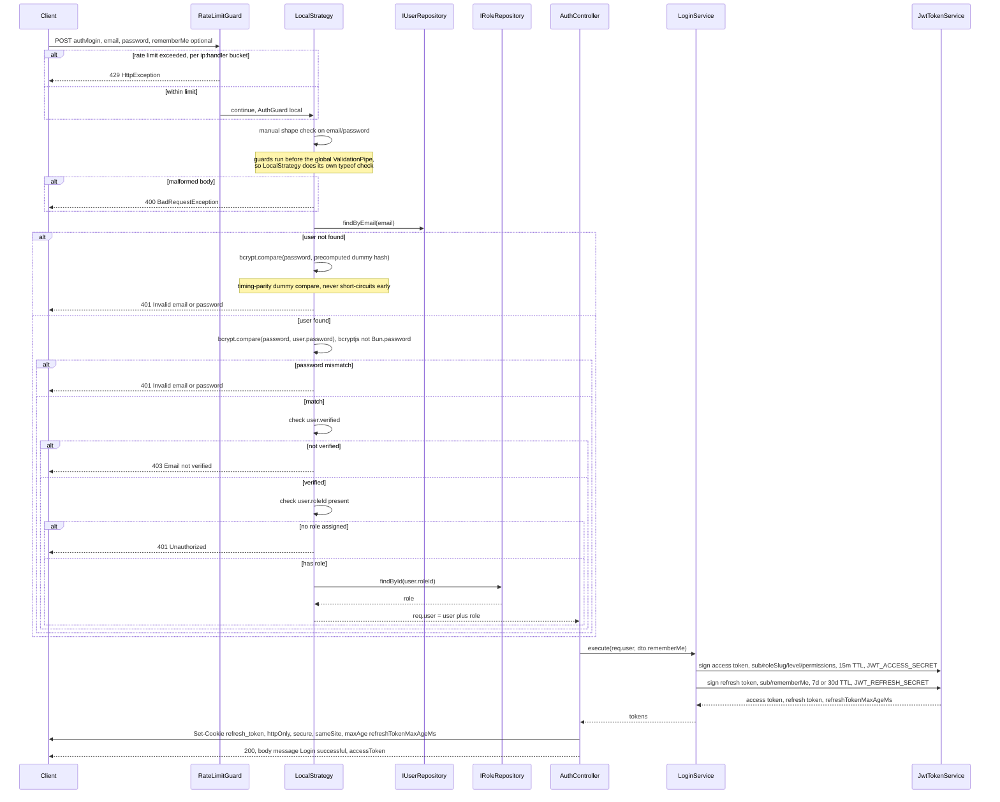
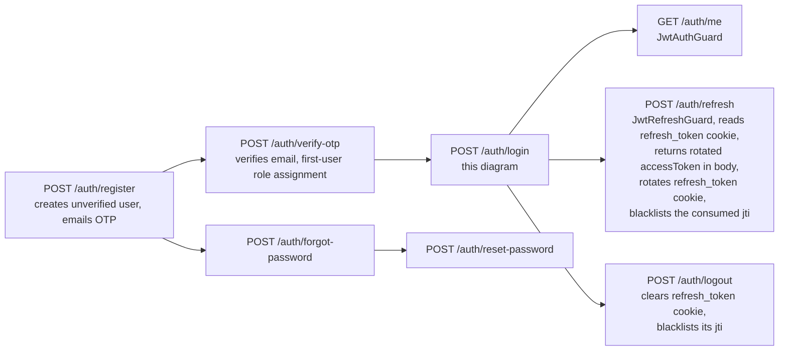

# Login flow

Scope: `POST /auth/login`, from request to response (`accessToken` in the JSON body,
`refresh_token` as a `Set-Cookie`). Read directly from `src/modules/auth/**` (all
layers) and `src/common/guards/*` — not inferred. Cross-referenced against
`docs/documents/auth.md` for narrative context only.

## Diagram — login sequence

## Diagram — where login sits among auth endpoints

## Notes

- Password hashing uses `bcryptjs` (pure JS) rather than `Bun.password`, because the test
  suite runs under Jest/Node where `Bun` is `undefined` even though the app itself runs on
  Bun (`docs/documents/auth.md`).
- `verify-otp` is a one-time email-verification/first-user role-assignment step, not part of
  the login request itself.
- Only one cookie now: `refresh_token` (const `REFRESH_TOKEN_COOKIE` in
  `jwt-refresh.guard.ts`); flags come from `COOKIE_SECURE` / `COOKIE_SAMESITE` env vars.
  The access token is returned in the response body (`accessToken`) instead — the client
  holds it in memory and sends it back as `Authorization: Bearer <token>` on every
  subsequent request; see `auth-jwt-flow-diagram.md`.

Sources read: `src/modules/auth/presentation/auth.controller.ts`,
`src/common/strategies/local.strategy.ts`,
`src/modules/auth/application/services/login.service.ts`,
`src/common/token/jwt-token.service.ts`, `src/common/guards/rate-limit.guard.ts`,
`src/common/guards/jwt-auth.guard.ts`, `src/common/guards/jwt-refresh.guard.ts`.
