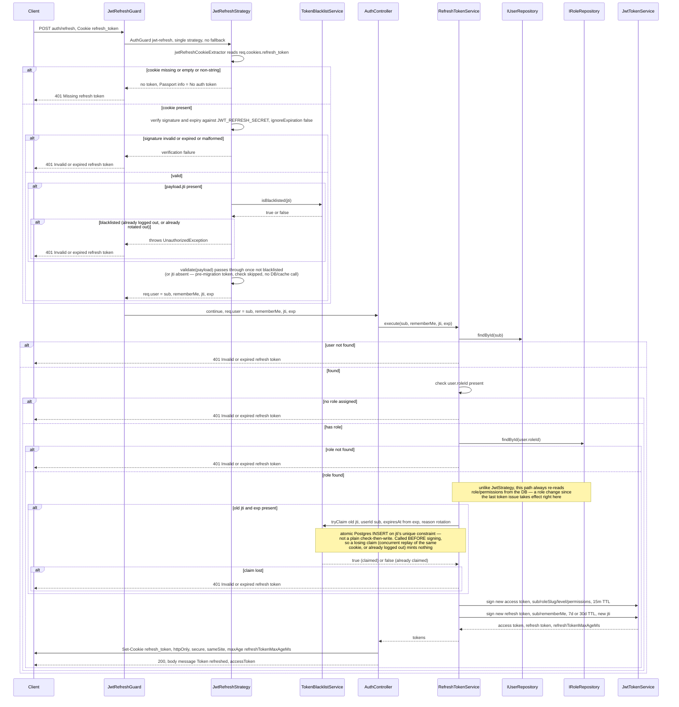
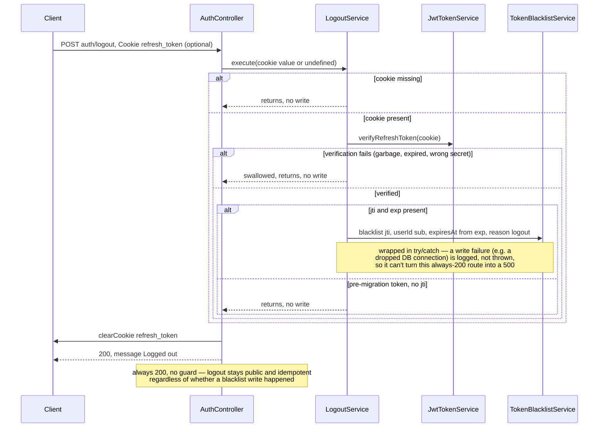

# Refresh token flow — rotation and logout

Scope: `POST /auth/refresh` and `POST /auth/logout`, from the `refresh_token` cookie to
response (a rotated `accessToken` in the JSON body plus a rotated `refresh_token`
cookie). Read directly from `src/common/strategies/jwt-refresh.strategy.ts`,
`src/common/guards/jwt-refresh.guard.ts`,
`src/modules/auth/application/services/refresh-token.service.ts`,
`src/modules/auth/application/services/logout.service.ts`,
`src/common/token-blacklist/token-blacklist.service.ts`, and
`src/modules/auth/presentation/auth.controller.ts` — not inferred. Cross-referenced
against `docs/documents/auth.md` and `docs/documents/token-blacklist.md` for narrative
context only. See `login-flow-diagram.md` for how the pair is first issued and
`auth-jwt-flow-diagram.md` for how the access token is verified on every other request.

## Diagram — refresh sequence

## Diagram — logout

## Notes

- **Rotation is now single-use, not just replacement — even under concurrent replay.**
  Every successful refresh still issues a brand-new access/refresh pair — the new
  access token comes back in the response body, the new refresh token overwrites the
  `refresh_token` cookie — but the refresh token just consumed is also atomically
  claimed (`reason: "rotation"`) via `tryClaim`, **before** signing, not after. A
  replay of the old cookie now fails with the same `401 Invalid or expired refresh
  token` a garbage cookie would, instead of quietly minting another valid pair. The
  "before, not after" ordering matters: an earlier version wrote the blacklist entry
  as the *last* step (after signing), which left a real check-then-write race — two
  concurrent requests replaying the same not-yet-consumed cookie could both pass an
  `isBlacklisted()` check before either write landed, each minting a valid pair. Found
  during the five-axis review (empirically reproduced: ~1-in-5 failure rate under a
  `Promise.all`-driven e2e test against real Postgres), fixed by making the claim a
  Postgres unique-constraint `INSERT` (`tryClaim`) called before any signing happens —
  see `docs/documents/token-blacklist.md`'s "Concurrency" section.
- **The one place a refresh differs from a plain authenticated request:**
  `JwtStrategy.validate` (access token, every other route) never touches the
  database — `RefreshTokenService.execute` (this flow) always re-fetches `User` and
  `Role` from Postgres before signing the next access token. That is the mechanism
  by which a permission or role change actually reaches an already-logged-in session.
- **Logout now revokes.** `POST /auth/logout` still calls `res.clearCookie()` once
  (`refresh_token` — there's no `access_token` cookie left to clear), but first hands
  the cookie's raw value to the new `LogoutService`, which blacklists its `jti` via
  `TokenBlacklistService` (Postgres-authoritative, optional sticky-degraded Redis
  cache — see `docs/documents/token-blacklist.md`). Any verification failure along the
  way (missing/garbage/expired cookie) is swallowed so the route stays public,
  always-`200`, and idempotent — it never throws, it just skips the write; a failure
  *during* the write itself (a transient DB error) is caught and logged rather than
  propagated, for the same always-`200` reason (a review-driven fix — the original
  version let a write failure 500 the route). The one remaining gap: a refresh token minted before this feature shipped carries no `jti`
  and cannot be blacklisted by either logout or rotation — it stays valid for the rest
  of its original 7d/30d TTL. A leaked access token is still exploitable for at most
  15 minutes regardless of logout, unchanged from before — access tokens are
  deliberately never persisted or checked against a blacklist.
- **`JwtRefreshGuard` has no fallback strategy** (unlike `JwtAuthGuard`, which tries
  `jwt` then `api-token`) — a missing or invalid refresh cookie fails immediately, now
  joined by a blacklisted-jti check inside `JwtRefreshStrategy.validate` itself rather
  than a separate guard.

Sources read: `src/common/strategies/jwt-refresh.strategy.ts`,
`src/common/guards/jwt-refresh.guard.ts`,
`src/modules/auth/application/services/refresh-token.service.ts`,
`src/modules/auth/application/services/logout.service.ts`,
`src/common/token-blacklist/token-blacklist.service.ts`,
`src/modules/auth/presentation/auth.controller.ts`,
`src/common/token/jwt-token.service.ts`, `docs/documents/auth.md`,
`docs/documents/token-blacklist.md`.
