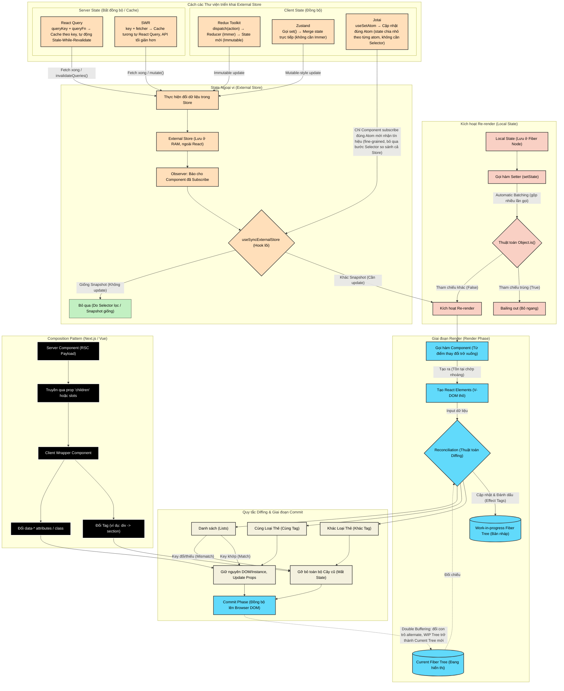

# Tổng quan Kiến trúc React: Fiber, State, và External Store

Biểu đồ dưới đây mô phỏng luồng hoạt động từ lúc State (cả nội bộ và ngoại vi) thay đổi, cách React quản lý V-DOM, Fiber Tree, cho đến các Pattern tối ưu trên Next.js.

## 1. Biểu đồ luồng hoạt động (Architecture Flow)

**Vì sao có 2 Fiber Tree (`F1`/`F2`)?** React dùng kỹ thuật **Double Buffering** (giống cơ chế double-buffer khi render game): `F1` là cây đang hiển thị trên màn hình, `F2` là bản nháp được build song song trong Render Phase để đối chiếu diff mà không đụng vào cây đang hiển thị. Sau khi `C3` (Commit Phase) đồng bộ xong lên DOM thật, React chỉ đổi con trỏ `alternate` — `F2` trở thành `F1` mới cho chu kỳ render tiếp theo, không phải copy lại dữ liệu nên gần như tức thời.

## 2. Cơ chế hoạt động của các Thư viện State Ngoại vi

**Client State (đồng bộ, chạy trên RAM, không có khái niệm "cũ/mới với server"):**

- **Redux Toolkit**: `dispatch(action)` → `reducer` (dùng Immer nội bộ) tính ra state mới theo kiểu **immutable** → store phát tín hiệu cho mọi component đang subscribe qua `useSyncExternalStore`.
- **Zustand**: gọi `set()` để merge thẳng vào store, không cần action/reducer — tối giản hơn Redux nhưng vẫn dùng chung cơ chế `useSyncExternalStore` + selector để tránh render thừa.
- **Jotai**: chia state thành nhiều **atom** độc lập thay vì một store lớn. Khi `useSetAtom` một atom, chỉ những component đang đọc đúng atom đó (và các atom phụ thuộc nó) mới nhận tín hiệu re-render — không cần tự viết Selector như Redux/Zustand.

**Server State (bất đồng bộ, có cache & tự đồng bộ với server):**

- **React Query**: xác định cache bằng `queryKey`, gọi `queryFn` để fetch, áp dụng chiến lược **Stale-While-Revalidate** (trả cache cũ ngay lập tức, âm thầm fetch lại nếu đã stale). Mutation xong gọi `invalidateQueries()` để đánh dấu cache cũ và kích hoạt refetch.
- **SWR**: cùng triết lý stale-while-revalidate và cũng dùng `useSyncExternalStore` nội bộ, nhưng API tối giản hơn — chỉ cần `key` + `fetcher`, và gọi `mutate()` để cập nhật/làm mới cache thủ công.

Điểm chung: dù là client state hay server state, tất cả đều hội tụ về đúng một cơ chế lõi của React — thay đổi dữ liệu trong store, rồi để `useSyncExternalStore` so sánh snapshot và quyết định có kích hoạt re-render hay không (xem nhánh `subExternal` trong biểu đồ).
